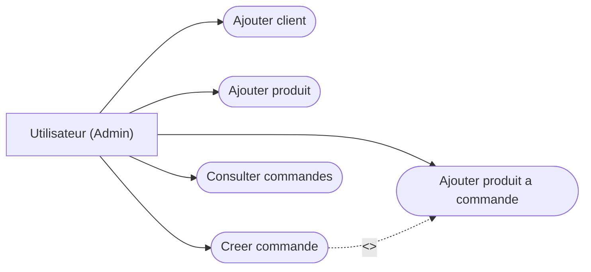
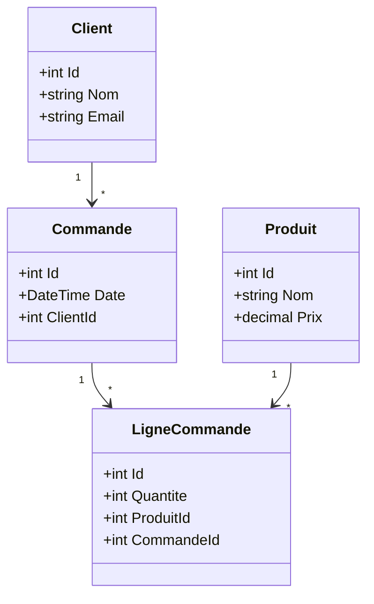
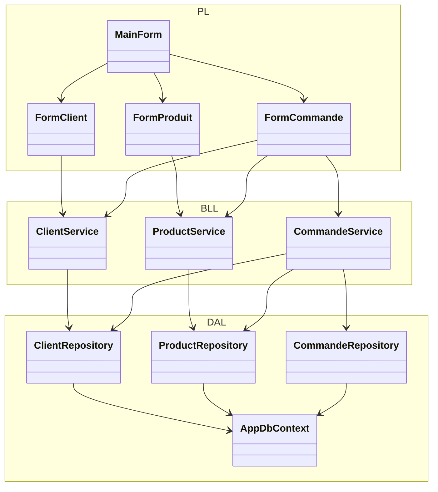
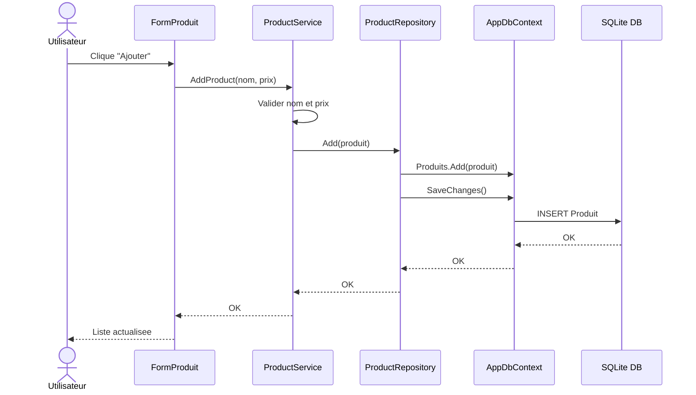
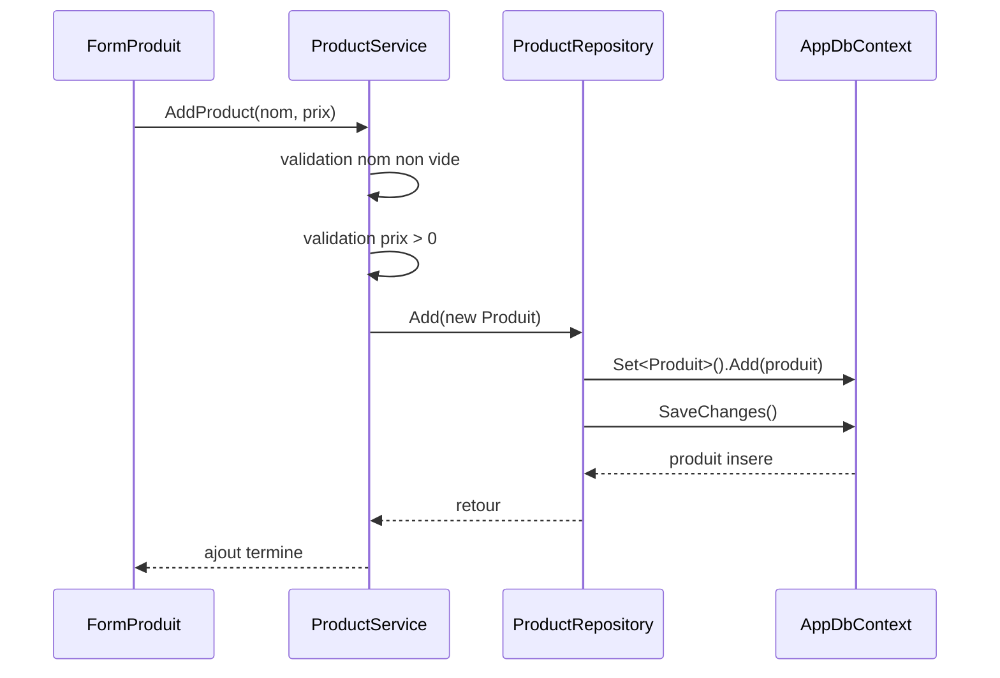

# Diagrammes UML - Gestion des commandes

## 1. Diagramme de Use Case

## 2. Diagramme de classes conceptuel

## 3. Diagramme de classes technique - 3 couches

Relation globale : `UI -> Service -> Repository -> DB`.

## 4. Diagramme de sequence - Ajouter un produit

## 5. Diagramme de sequence boite blanche - Ajouter un produit

